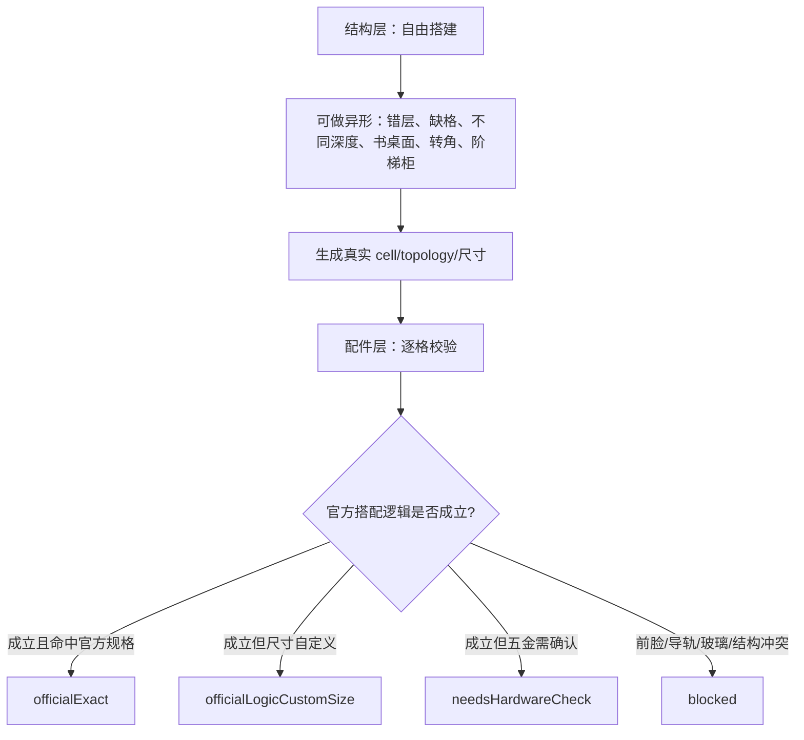
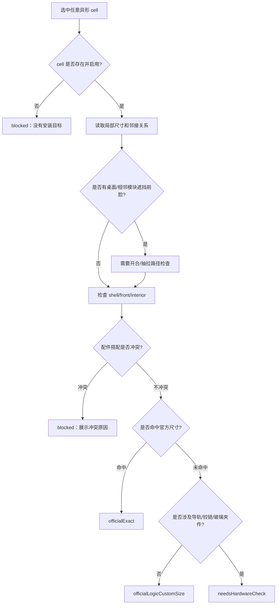
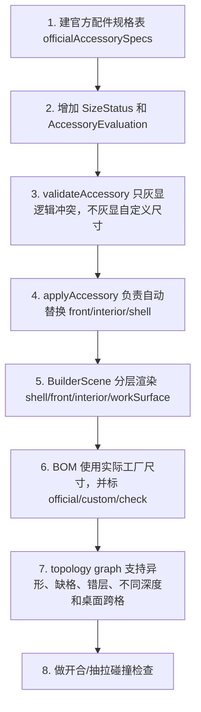
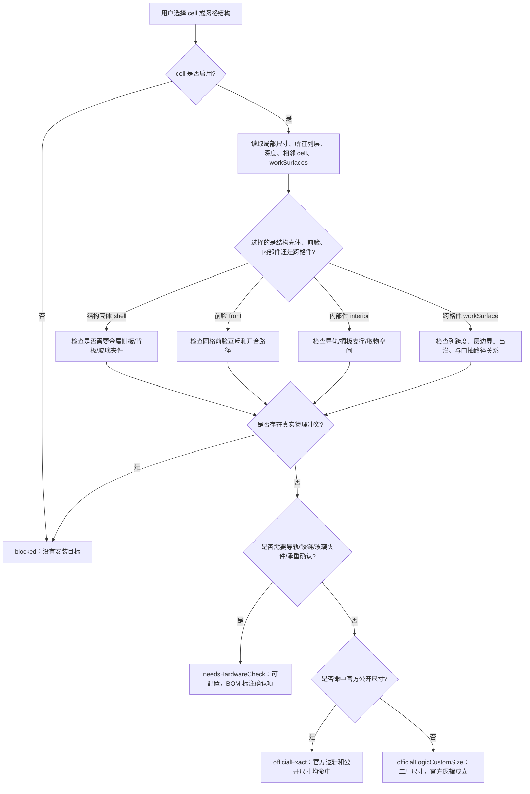

# USM 本地配置器配件逻辑导图

版本：0.2
用途：在“本地可做异形结构、工厂 BOM 支持自定义尺寸”的前提下，把配件搭配逻辑尽量同步 USM 官方公开规则。
边界：本地配置器可以输出自定义尺寸、异形结构和工厂拆单，但不能把非官方规格表达成 USM 官方 SKU。

## 0. 这版的核心修正

0.1 版把很多尺寸写成“禁用”。这不符合当前产品目标。

正确口径是：

- 结构自由：允许非矩形、错层、局部缺格、不同深度、桌面组合、异形展示柜等本地结构。
- 尺寸自由：工厂 BOM 可以按实际宽、高、深输出自定义板件、钢管、玻璃、门板、托盘和抽屉。
- 逻辑同步官方：配件之间的搭配关系要尽量与 USM 官方公开规格同步，例如普通固定层板需要金属侧板承载、玻璃搁板在玻璃或金属侧板之间需确认夹件、extension shelf 用伸缩导轨、下翻门/extension door 有对应深度逻辑。
- 非官方尺寸不灰显：自定义尺寸进入“工厂定制”状态，而不是直接禁用。
- 只有物理/结构冲突才禁用：例如一个格口不能同时有下翻门和抽屉前脸；移动托盘不能被门挡住；玻璃箱体不能默认承载导轨。

UI 状态应改成 4 类：

| 状态 | 含义 | UI 表现 |
| --- | --- | --- |
| `officialExact` | 完全命中官方公开规格和组合逻辑。 | 正常可选，标记“官方规格”。 |
| `officialLogicCustomSize` | 搭配逻辑符合官方，但尺寸由工厂定制。 | 正常可选，标记“工厂定制尺寸”。 |
| `needsHardwareCheck` | 搭配逻辑可成立，但导轨/铰链/玻璃夹件需要确认。 | 可选但提示确认，不进入官方 SKU。 |
| `blocked` | 结构或配件逻辑冲突。 | 灰显，展示具体原因。 |

## 1. 公开资料依据

本文件参考以下公开页面：

- USM Haller System 官方规格页：`https://us.usm.com/pages/usm-haller-system`
- USM Flexible Shelving 官方案例页：`https://www.usm.com/en/solutions/living/shelving`
- USM Custom Desk Unit 官方商品页：`https://us.usm.com/products/usm-haller-custom-desk-unit-a`
- USM Shelving R1 官方商品页：`https://us.usm.com/products/usm-haller-shelving-r1`

关键依据：

- USM shelving 官方文案说明 shelving “no fixed size”，可做 customised wall shelving 和 free-standing room dividers。
- USM 官方也鼓励 “Think outside the box”，展示不总是常规家具类型的个性化方案。
- USM Custom Desk Unit 是带 integrated work surface 的书桌单元，并包含一个 14 inch storage compartment 和 drop-down door。
- USM Shelving R1 案例中，上部是 14 inch drop down door，下部是 14 inch drawer，说明下翻门和抽屉可以在上下不同格共存，但不能在同一格前脸共存。
- 官方规格页公开了 metal drop-down door、metal extension door、metal extension shelf、metal divider shelf、glass divider shelf、glass door、drawers 等配件规格和说明。

## 2. 产品分层：结构自由，配件校验

本地配置器要拆成两套规则：



### 2.1 结构层放开的内容

这些都应该允许：

- 局部缺格：例如 3 列 3 层中间少一格，形成异形轮廓。
- 错层：不同列高度不同，形成阶梯书柜。
- 不同深度：一部分 350 深，一部分 500 深，做边柜或桌边收纳。
- 桌面/书桌单元：若某一层是工作台面，可以跨多个 cell，下面仍可放下翻门、抽屉或开放格。
- 局部开放框架：某些格只保留钢管和球节点。
- Room divider：双面展示柜、无背板柜、前后不同功能。

结构层只负责判断“能不能形成稳定的几何和 BOM”，不负责把配件灰掉。

### 2.2 配件层仍然严格

配件层逐格判断：

- 这个格有没有可安装配件的结构面。
- 前脸是否已被别的门/抽屉占用。
- 导轨是否有左右安装基础。
- 玻璃夹件是否有金属 panel elements 支撑。
- 门的开启路径是否被托盘、抽屉、桌面或相邻模块挡住。
- 当前尺寸是官方规格、工厂定制、还是需要五金确认。

## 3. 推荐数据模型

不要继续把一个格子压缩成一个 `CellKind`。应分为 topology、shell、front、interior、workSurface。

```ts
type SizeStatus =
  | "officialExact"
  | "officialLogicCustomSize"
  | "needsHardwareCheck"
  | "blocked";

interface TopologyCell {
  id: string;
  enabled: boolean;
  row: number;
  column: number;
  x: number;
  y: number;
  z: number;
  width: number;
  height: number;
  depth: number;
  neighbors: {
    left?: string;
    right?: string;
    top?: string;
    bottom?: string;
    front?: string;
    back?: string;
  };
}

interface ProductCell {
  topologyId: string;
  shell: "open" | "metalPanel" | "noBack" | "glassPanel" | "frameOnly";
  front: "none" | "dropDoor" | "flipUpDoor" | "sideOpenDoor" | "glassDoor" | "extensionDoor" | "drawerFront";
  interior: "none" | "fixedShelf" | "fixedTray" | "mobileTray" | "glassShelf" | "rimmedDrawer";
  workSurface?: "none" | "deskTop" | "bridgeTop";
  color?: string;
}

interface AccessoryEvaluation {
  status: SizeStatus;
  officialSpec?: string;
  hardwareTemplate?: string;
  reasons: string[];
  warnings: string[];
  autoFix?: Partial<ProductCell>;
  bomSize: { width: number; height: number; depth: number };
}
```

关键点：

- `officialSpec` 只说明是否命中官方公开尺寸。
- `bomSize` 永远用实际工厂尺寸，不被官方尺寸覆盖。
- 自定义尺寸不是错误，只是 `officialLogicCustomSize` 或 `needsHardwareCheck`。

## 4. 官方尺寸映射

官方公开页面以 inch 标注规格。本地可映射成近似 mm：

| 官方 inch | 本地近似 mm |
| --- | --- |
| 4 | 100 |
| 6 | 150 / 175 需按工厂口径确认 |
| 7 | 175 |
| 10 | 250 |
| 14 | 350 |
| 16 | 395 / 400 |
| 20 | 500 |
| 30 | 750 |

实现时不要写死“非这些尺寸禁用”。正确做法：

```text
命中官方尺寸：officialExact
未命中官方尺寸，但结构和配件逻辑成立：officialLogicCustomSize
未命中官方尺寸，且牵涉导轨/铰链/玻璃夹件：needsHardwareCheck
前脸、导轨、玻璃、开合路径冲突：blocked
```

## 5. 官方公开配件规格摘要

### 5.1 下翻门 metal drop-down door

官方公开信息：

- compartment depths：10 / 14 / 20 inch。
- 公开尺寸包括 7x20、7x30、10x20、10x30、14x14、14x16、14x20、14x30、16x20、16x30。
- 可配 handle、locking handle、latch handle、locking latch handle。

本地规则：

- 官方规格命中时标记 `officialExact`。
- 自定义宽高但仍是下翻门结构，标记 `officialLogicCustomSize`。
- 自定义深度或超大门板，标记 `needsHardwareCheck`，因为铰链、限位链、门板重量和开合半径要确认。
- 只有前脸冲突、无安装侧板、开合路径被阻挡时才 `blocked`。

### 5.2 extension door 和 mobile tray / extension shelf

官方公开信息：

- metal extension door 的 compartment depths：14 / 20 inch。
- metal extension shelf 使用 telescoping extension rails。
- metal extension shelf 公开尺寸包括 14x16、14x20、14x30、20x16、20x20、10x30。

本地规则：

- “移动托盘”应分成两类：
  - `mobileTray`：无前脸的内部移动托盘。
  - `extensionDoor`：带前脸、导轨和把手/锁的 extension door。
- 二者都需要左右导轨安装基础。
- 二者不能和下翻门、玻璃门、抽屉前脸共占同一前脸。
- 自定义尺寸可做工厂 BOM，但导轨长度、承重和防倾要进入 `needsHardwareCheck`。

### 5.3 fixedShelf / fixedTray

官方公开信息：

- metal divider shelf 可 mounted at any height。
- 公开尺寸包括 10x30、14x20、14x30、20x20、20x30。

本地规则：

- 固定层板/固定托盘是移动托盘的 fallback。
- 只要不是 `frameOnly` 且有可安装基础，就不要因为尺寸自定义而禁用。
- 与下翻门、玻璃门可以共存，但必须检查门打开时是否碰撞。
- 若格子很低，例如 100 mm，高度不是禁用理由，但 UI 应提示“取物空间低”。

### 5.4 带围边抽屉 rimmedDrawer

官方公开信息：

- 官方页面公开了 Drawer 4、Drawer 6、Drawer 10、Drawer 12 等抽屉类型。
- 示例 Shelving R1 说明一个柜体可以上格下翻门、下格抽屉，但这发生在不同 cell。

本地规则：

```text
带围边抽屉 = drawerFront + mobile tray/drawer bottom + rails + rim panels + rear/side panels
```

- 抽屉前脸独占 front，不能和下翻门、玻璃门、侧开门、extension door 同格共存。
- 抽屉自带导轨，不能再叠加 `mobileTray`。
- 需要 `shell=metalPanel` 或自动切成金属箱体。
- 自定义宽高深进入 `officialLogicCustomSize` 或 `needsHardwareCheck`，不直接禁用。
- 如果一个高格要做多抽，应建模为“同一 cell 内多 drawer bay”，不是把一个 500 高单抽硬塞进去。

### 5.5 玻璃、玻璃门、玻璃搁板

必须分开：

| 类型 | 层级 | 说明 |
| --- | --- | --- |
| `glassPanel` | shell | 玻璃箱体/玻璃结构面。 |
| `glassDoor` | front | 前脸玻璃门。 |
| `glassShelf` | interior | 内部玻璃搁板。 |

官方公开信息：

- glass door 是 single-panel safety glass，可有 handle 或 locking handle，hinges 有 black/chrome。
- glass divider shelf 可 mounted at any height；本地规则允许安装在玻璃侧板或金属侧板之间，但需要生产确认夹件、支撑和承重。

本地规则：

- 玻璃门默认按左右侧开玻璃门，不默认当玻璃下翻门。
- 玻璃门可配 `shell=metalPanel`，此时只是把前脸换成玻璃门，不是整格玻璃箱体。
- 玻璃门可配 `shell=glassPanel`，形成展示格。
- 玻璃门不能和抽屉、下翻门、extension door 共占前脸。
- 玻璃搁板必须有金属 panel elements 支撑；`shell=glassPanel` 里加玻璃搁板需要单独夹件确认，先标 `needsHardwareCheck`。

## 6. 异形结构下的配件判断导图



## 7. 关键配件互斥矩阵

`允许` 表示可直接共存；`替换` 表示选择新配件时清空旧配件；`确认` 表示可做但需要五金/碰撞确认；`禁用` 表示逻辑冲突。

| 新选择 \ 当前已有 | 下翻门 | 移动托盘 | 固定托盘 | 带围边抽屉 | 玻璃箱体 | 玻璃门 | 玻璃搁板 |
| --- | --- | --- | --- | --- | --- | --- | --- |
| 下翻门 | 允许 | 替换为固定托盘或清空 | 允许，需开合检查 | 替换抽屉 | 替换为金属箱体或确认 | 替换玻璃门 | 允许，需开合检查 |
| 移动托盘 | 禁用 | 允许 | 替换固定托盘 | 禁用 | 确认，默认禁用导轨 | 禁用 | 替换玻璃搁板 |
| 固定托盘 | 允许，需开合检查 | 替换移动托盘 | 允许 | 确认，多层抽屉另建 | 允许 | 允许，需开合检查 | 替换玻璃搁板 |
| 带围边抽屉 | 替换下翻门 | 替换移动托盘 | 替换固定托盘 | 允许 | 替换为金属箱体或禁用 | 替换玻璃门 | 禁用 |
| 玻璃箱体 | 替换下翻门 | 确认，默认禁用导轨 | 允许 | 禁用 | 允许 | 允许 | 确认夹件 |
| 玻璃门 | 替换下翻门 | 禁用 | 允许，需开合检查 | 替换抽屉 | 允许 | 允许 | 允许 |
| 玻璃搁板 | 允许，需开合检查 | 替换移动托盘 | 替换固定托盘 | 禁用 | 确认夹件 | 允许 | 允许 |

## 8. 下翻门具体逻辑

### 8.1 允许条件

- cell 启用。
- 有左右安装基础：`metalPanel` 最稳；`noBack` 可做；`open/frameOnly` 需要自动补侧板或禁用。
- front 没有抽屉、玻璃门、侧开门、上翻门、extension door。
- 开合路径没有被桌面、相邻前凸模块、移动托盘阻挡。
- 尺寸可以是官方尺寸，也可以是工厂定制尺寸。

### 8.2 什么时候不能用下翻门

| 场景 | 状态 | 原因 |
| --- | --- | --- |
| 同格已有抽屉前脸 | `blocked` | 前脸冲突。 |
| 同格已有移动托盘且不改固定 | `blocked` | 抽拉路径和门开合冲突。 |
| 全框架且不补侧板 | `blocked` | 没有铰链和限位安装基础。 |
| 桌面压住门的打开轨迹 | `blocked` 或 `needsHardwareCheck` | 开合碰撞风险。 |
| 自定义尺寸 | `officialLogicCustomSize` 或 `needsHardwareCheck` | 不是禁用，只是非官方标准。 |

## 9. 移动托盘和固定托盘具体逻辑

### 9.1 移动托盘

移动托盘是导轨件，核心不是尺寸，而是导轨安装和抽拉路径：

- 必须有左右安装面。
- 前方不能被门、玻璃门、抽屉前脸挡住。
- 若要带前脸，应使用 `extensionDoor`，不要和普通 `mobileTray` 混在一起。
- 命中官方 extension shelf 尺寸时为 `officialExact`。
- 自定义宽深时为 `needsHardwareCheck`，因为导轨长度、承重、防倾要确认。

### 9.2 固定托盘

固定托盘不需要导轨：

- 是移动托盘不可用时的默认 fallback。
- 可与下翻门、玻璃门共存，但要做开合碰撞检查。
- 可用于自定义尺寸和异形格。
- 对很浅或很低的格子，提示使用体验，不直接禁用。

## 10. 玻璃类具体逻辑

### 10.1 玻璃箱体

- 适合展示格。
- 默认不承载抽屉、移动托盘、普通固定托盘或普通金属门五金。
- 可以搭配玻璃门。
- 若用户选择普通下翻门、上翻门、侧开金属门、移动托盘、固定托盘或普通金属搁板，当前实现直接 `blocked`，要求先切换为金属箱体或重新拆分结构。
- 玻璃搁板不是直接禁用，但必须进入 `needsHardwareCheck`，确认玻璃夹件或金属支撑。

### 10.2 玻璃门

- front 独占。
- 默认侧开。
- 可以配金属箱体或玻璃箱体。
- 与移动托盘、抽屉、下翻门同格互斥。

### 10.3 玻璃搁板

- 官方逻辑：只能与 metal panel elements 搭配。
- `metalPanel`：允许。
- `noBack`：允许但提示展示效果和背部支撑不同。
- `glassPanel`：需要夹件确认，先 `needsHardwareCheck`。
- `open/frameOnly`：没有安装基础则 `blocked`。

## 11. 书桌和异形柜实现规则

USM 官方 Custom Desk Unit 证明“工作台面 + 下部储物模块 + 下翻门”是合理产品方向。本地配置器要支持：

- `workSurface=deskTop`：桌面作为跨 cell 的结构件，不占用某个 cell 的 front。
- 桌面下方 cell 可配置下翻门、抽屉、开放格、固定托盘。
- 桌面必须参与碰撞检查：如果桌面挡住上翻门、下翻门或抽拉托盘的路径，配件进入 `blocked` 或 `needsHardwareCheck`。
- 异形柜的配件校验只看局部 cell 和相邻关系，不要求整体柜体是矩形。

当前已落地的第一步：

- `CabinetConfig.workSurfaces` 保存跨格桌面/桥接台面，字段包括列跨度、所在层、深度、厚度和前后左右出沿。
- `书桌单元` 预设已生成一个跨 4 列的 `deskTop`，BOM 输出为 `跨格桌面 2500 x 640 x 32 mm`。
- 3D 场景已渲染桌面厚板，并把桌面出沿计入相机包围盒和外部尺寸。
- 评估层已接入台面路径初筛：上翻门撞台面会 `blocked`；移动托盘/带围边抽屉在台面下方会根据高度和出沿进入 `blocked` 或 `needsHardwareCheck`；下翻门按官方书桌方向允许，但提示限位链和开启半径确认。

### 11.1 台面参与配件路径判断

当前二维网格阶段先做局部规则，不等 topology graph 完成：

| 场景 | 状态 | 推荐动作 |
| --- | --- | --- |
| 上翻门所在格上沿正好有跨格台面 | `blocked` | 改下翻门、侧开门、开放格或移出台面 |
| 移动托盘所在格高度低于 120 mm | `blocked` | 只能改固定托盘、固定搁板或开放格 |
| 移动托盘所在格高度低于 175 mm，且上方有台面 | `blocked` | 改固定托盘，避免抽拉和取物空间不足 |
| 移动托盘上方有台面，但高度足够 | `needsHardwareCheck` | 确认导轨行程、手部空间、承重和防倾 |
| 带围边抽屉所在格高度低于围边高度 | `needsHardwareCheck` | 允许建模，但需确认围边、导轨、安装结构和 BOM |
| 带围边抽屉上方有台面，抽拉余量偏紧 | `needsHardwareCheck` | 确认围边高度、导轨位置和台面下沿间隙 |
| 下翻门上方有书桌台面 | `officialExact` / `officialLogicCustomSize`，附警告 | 可做，但确认限位链、全开角度和台面出沿 |
| 下翻门遇到超大台面前出沿 | `needsHardwareCheck` | 确认门板开启半径和限位五金 |

异形结构的数据要从二维数组升级为 topology graph：

```text
当前：cells[row][column]
目标：cellsById + adjacency + per-cell size/depth + optional spanning surfaces
```

## 12. UI 文案

| 规则 ID | 文案 |
| --- | --- |
| `official.exact` | 命中官方公开规格。 |
| `factory.customSize` | 当前尺寸由工厂定制，配件逻辑按官方方式处理。 |
| `hardware.check` | 该尺寸需要确认导轨、铰链或玻璃夹件。 |
| `front.occupied` | 当前格口已有前脸配件，选择后会替换原配件。 |
| `front.pathBlocked` | 当前配件需要正面打开或抽拉，路径被其他结构挡住。 |
| `shell.needMetalPanel` | 该配件需要金属箱体或金属侧板支撑。 |
| `shell.glassNoRails` | 玻璃箱体默认不支持抽屉导轨。 |
| `glass.metalOnly` | 玻璃搁板需要金属 panel elements 支撑。 |
| `drawer.frontConflict` | 抽屉前脸不能和门类配件同格共存。 |

## 13. 实现顺序



第一阶段先做规则引擎，不急着一次性改完异形拓扑：

1. 在现有 `cells[row][column]` 上先实现 `officialExact / officialLogicCustomSize / needsHardwareCheck / blocked`。
2. 把“尺寸不支持”的灰显全部改成“工厂定制尺寸”或“五金确认”。
3. 保留真正禁用：前脸冲突、导轨安装面缺失、玻璃搁板无金属 panel、开合路径冲突。
4. 再升级 topology graph，支持书桌和异形柜。

## 14. 仍需工厂确认，但不阻塞配置器

这些问题不再阻塞用户配置，只影响 BOM 标注和报价准确性：

- 自定义下翻门的铰链/限位链规格和最大门板重量。
- 自定义移动托盘导轨长度、承重和防倾要求。
- 窄抽屉、宽抽屉、高抽屉的围边高度和导轨型号。
- 玻璃箱体中加玻璃搁板的夹件方案。
- 书桌面跨格时，桌面和球节点/钢管的连接方式。
- 异形柜相邻模块共享板件时，板件是否去重或按功能模块拆单。

## 15. 产品逻辑导图 v0.3

这一节用于落地实现。配置器不要先问“是不是官方尺寸”，而要先问“这个配件有没有物理安装基础、前脸有没有冲突、开合/抽拉路径有没有被挡住”。官方尺寸只决定 `officialExact`，不决定工厂定制是否可做。



### 15.1 单格配件判断顺序

| 顺序 | 问题 | 通过后进入 | 不通过结果 |
| --- | --- | --- | --- |
| 1 | 当前格是否存在且启用？ | 局部尺寸判断 | `blocked` |
| 2 | 当前模式是否有安装面？例如不是 `frameOnly` | 配件层判断 | `blocked`，除非自动补壳体 |
| 3 | 配件占用的是 shell、front 还是 interior？ | 对应互斥表 | 先提示替换，不直接禁用 |
| 4 | 是否与已有 front 冲突？如下翻门 vs 抽屉前脸 | 自动替换或禁用 | 同格双前脸为 `blocked` |
| 5 | 是否需要导轨、铰链或夹件？ | 五金判断 | 无安装基础为 `blocked` |
| 6 | 是否被跨格台面或相邻前凸结构挡住？ | 路径判断 | 碰撞明确为 `blocked`，不确定为 `needsHardwareCheck` |
| 7 | 是否命中官方公开尺寸？ | 输出状态 | 命中 `officialExact`，未命中但逻辑成立 `officialLogicCustomSize` |

### 15.2 什么时候不能用下翻门

下翻门是 front 配件，核心限制不是尺寸，而是前脸独占、铰链安装和下翻路径。

| 场景 | 状态 | 处理 |
| --- | --- | --- |
| 同格已有带围边抽屉或移动托盘前脸 | `blocked` 或替换 | 默认替换原 front；如果用户要叠加则禁用 |
| 当前为 `frameOnly` 且不补侧板/背板 | `blocked` | 需要切到金属壳体或无背板模块 |
| 门板过高、过宽、超重 | `needsHardwareCheck` | 确认铰链、限位链、门板重量 |
| 书桌台面在上方但不压住下翻轨迹 | `officialExact` / `officialLogicCustomSize` + warning | 允许，提示确认限位链和开启半径 |
| 台面前出沿很大，门板全开角度可能受限 | `needsHardwareCheck` | 可配置但 BOM/报价标注确认 |
| 非官方宽高深但逻辑成立 | `officialLogicCustomSize` 或 `needsHardwareCheck` | 不因为尺寸定制而禁用 |

### 15.3 什么时候移动托盘装不了，只能固定托盘

移动托盘是导轨件，固定托盘是无导轨件。只要移动路径、导轨或手部空间不成立，就应推荐固定托盘。

| 场景 | 移动托盘 | 固定托盘 |
| --- | --- | --- |
| 高度低于 120 mm | `blocked` | 允许，提示使用空间低 |
| 高度低于 175 mm 且上方有台面 | `blocked` | 允许 |
| 玻璃箱体且无金属安装面 | `blocked` | 普通固定托盘也禁用；改玻璃搁板并确认夹件，或切换金属箱体 |
| 前脸已有下翻门、玻璃门、抽屉前脸 | `blocked`，除非替换前脸 | 可共存但需开合检查 |
| 深度不是导轨常用深度 | `needsHardwareCheck` | 允许定制 |
| 台面前出沿影响抽拉和防倾 | `needsHardwareCheck` | 允许 |
| 非官方宽深但导轨可定制 | `needsHardwareCheck` | `officialLogicCustomSize` |

### 15.4 带围边抽屉的底线

带围边抽屉 = front + mobile tray + rails + rim panels。它比移动托盘更强，因为它还独占前脸。

| 场景 | 状态 | 处理 |
| --- | --- | --- |
| 模块高度低于围边高度 | `blocked` | 改固定托盘、开放格或降低围边方案 |
| 同格已有门类前脸 | 替换或 `blocked` | 默认替换原 front |
| 玻璃箱体 | `blocked` | 默认不承载抽屉导轨 |
| 上方有书桌台面，抽拉余量偏紧 | `needsHardwareCheck` | 确认围边高度、导轨位置、台面下沿间隙 |
| 深度非 350 / 500 mm | `needsHardwareCheck` | 确认导轨长度、承重、防倾 |
| 宽高深是工厂定制但导轨逻辑成立 | `officialLogicCustomSize` / `needsHardwareCheck` | 输出工厂 BOM，不灰显 |

### 15.5 玻璃类不能混成一个按钮

玻璃至少拆成三层：

| 类型 | 层级 | 关键限制 |
| --- | --- | --- |
| 玻璃箱体 `glassPanelModule` | shell | 展示用途；不是金属安装面，下翻门、普通托盘、普通层板和导轨件禁用 |
| 玻璃门 `glassDropDoor` | front | 和下翻门、抽屉前脸、移动托盘前脸互斥 |
| 玻璃搁板 `glassShelf` | interior | 可装在玻璃侧板或金属侧板之间；缺侧板禁用，生产需确认夹件 |

玻璃搁板在金属箱体和玻璃箱体里都保留为可选并标记 `needsHardwareCheck`，因为夹件、支撑和承重方案需要工厂确认；任一侧缺侧板时禁用。

## 16. 产品逻辑矩阵落地

导图规则已经落成机器可读矩阵：`docs/USM_ACCESSORY_LOGIC_MATRIX.json`。

生成命令：

```text
npm.cmd run export:logic-matrix
```

验证命令：

```text
npm.cmd run verify:logic
```

当前矩阵覆盖这些关键场景：

| 场景 | 用途 |
| --- | --- |
| 标准金属格 | 验证官方规格、移动托盘、下翻门等基础状态。 |
| 工厂自定义尺寸 | 验证非官方宽高不直接禁用，而是进入定制或五金确认。 |
| 低高度格 | 验证移动托盘装不了时，固定托盘仍可用。 |
| 玻璃箱体 | 验证玻璃箱体/玻璃侧板禁装下翻门、移动托盘、固定托盘和导轨，玻璃搁板进入夹件确认。 |
| 书桌台面下方左格 | 验证下翻门允许、上翻门撞台面禁用、移动托盘需确认。 |
| 书桌台面下方右格 | 验证带围边抽屉在台面下方需要导轨和抽拉余量确认。 |
| 混深局部 500 | 验证单格局部深度参与尺寸、配件规则和 BOM。 |

后续每加一种配件或异形结构，不要只改 UI。应同步增加：

1. `scripts/export-accessory-logic-matrix.mjs` 里的 scenario。
2. `assertAccessoryLogicMatrix()` 里的关键状态断言。
3. 前端按钮/禁用原因展示。
4. BOM 输出中的实际工厂尺寸和确认备注。

## 17. 生产校验报告

候选按钮只回答“这个格子能不能切换成某个配件”。生产中还需要回答“当前整柜方案是否合理”。当前实现已增加 `validateProductionConfig(config)`，作为内部规则和脚本门禁使用，不在前端单独显示。

报告分三类：

| 状态 | 含义 | 处理 |
| --- | --- | --- |
| `blocked` / 禁 | 当前方案存在生产硬冲突。 | 必须调整结构或配件。 |
| `needsReview` / 确认 | 没有硬冲突，但需要工厂确认五金、导轨、夹件、承重、异形边界或开合路径。 | 可以继续深化，但出 BOM 前要复核。 |
| `buildable` | 未发现硬冲突或必须确认项。 | 可进入工厂 BOM 复核。 |

当前报告已覆盖：

- 玻璃侧板/玻璃箱体：按展示格生产，提示不能直接叠加普通下翻门、移动托盘或固定托盘。
- 下翻门：提示门板、2 只下翻门铰链、锁盒、限位链和开合半径确认。
- 移动托盘：提示导轨安装面、导轨长度、承重、防倾和拉出行程确认。
- 玻璃搁板：提示玻璃夹件、支撑和承重确认。
- 低高度移动托盘：进入硬冲突，因为取物和抽拉空间不足。
- 异形缺格：进入确认项，因为需要确认球节点、钢管连续性和落地支撑。
- 跨格台面：进入确认项，因为可能影响上翻门、抽拉件、抽屉和门板开合路径。
